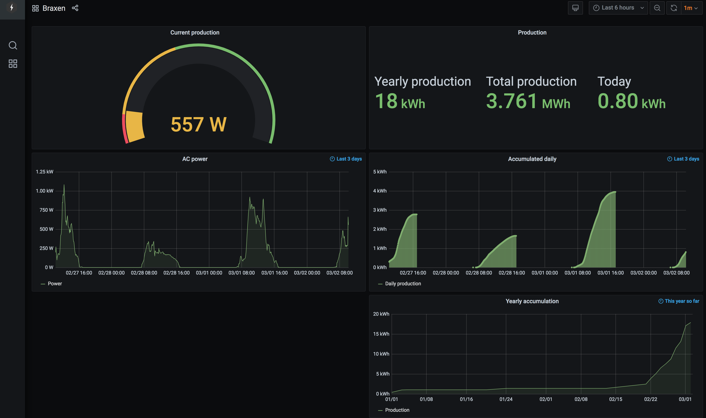

# fronius-to-postgres
Collect data from the Fronius Symo JSON API and store in a PostgreSQL database

Based on:
 - https://github.com/szymi-/fronius-to-influx
 - https://github.com/akleber/mqtt-connectors/blob/master/fronius-connector.py
 - Tutorials on https://www.postgresqltutorial.com/postgresql-python/

I don't know much about postgresql, so this is very much a hack. It probably
requires source code modifications to work for other people.


It's meant to be used with Grafana.

The docker directory contains some Dockerfiles which can be used to create
an environment for this script. It's meant to be used together with a postgres
database container in a docker compose file. I.e., something like

```
  database:
    image: postgres:12
    restart: always
    environment:
      - POSTGRES_USER=kalle
      - POSTGRES_PASSWORD=anka
      - POSTGRES_DB=kalle
    ports:
     - 5432:5432
    volumes:
      - kalle-db:/var/lib/postgresql/data

  fronius-script:
    image: fronius-script:latest
    restart: always
    environment:
      - DATABASE_USER=kalle
      - DATABASE_PASS=anka
      - DATABASE_NAME=kalle
      - DATABASE_HOST=database
      - FRONIUS_IP=<IP-to-the-inverter>
```


